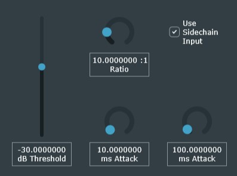

This DAW plugin applies a compression effect to audio using the JUCE library and custom digital signal processing logic. 

The effect is well-suited to help make a mix’s kick drum loud and clear, as the kick can be used as the sidechain input to compress other tracks.

The slides in this repo show the testing and a more complete explanation of the digital signal processing code.

# Parameters
A check box allows for the sidechain to be toggled on or off. When it is off, the compressor applies gain to the same track as it is detecting the level of. The other user parameters in the plugin are sliders for threshold and ratio, which control gain calculation, and attack time and release time, which control gain dynamics. The level detector is not adjustable by the user; it consists of a RMS detector with integration time 0.01 seconds.

# Signal Flow

The diagram shows the signal flow of the plugin. The final gain is always applied to the track the plugin is one, but the sidechain button determines which track will be used as input into the level detector and the rest of the final gain calculations. The gain calculator outputs a linear gain, which I found made debugging the plugin easier.

# GUI

The GUI consists of a vertical slider to adjust the threshold, a checkbox for the sidechain, and three dials for the other parameters. It is pictured below with the parameters set for the sidechain test from my presentation.

# Testing
I tested the plugin with the DAW Reaper and used Audacity to create simple visuals. Before the sidechain test, I tested the effect with a compressionTest.wav file, sending intermediate stages to the final output in order to visualize each calculation. I then repeated the same process for the sidechain test using a bass track and a kick drum track as the sidechain input.

